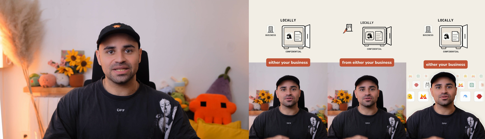

# Worked example: "Hermes Agent reads your documents locally"

One recording from run 28 (23 September 2026), followed from raw input to published output. This is the complete archive package the factory wrote to Google Drive, copied as-is.

*Left: the raw camera frame. Then the YouTube split, the Instagram whiteboard and the TikTok cutout, all at 10 s into the short.*

## Input

- **Raw recording:** `package/Source Assets/Raw/2026-09-21 14-25-45.mp4`. It's 158.7 s long and 1 GB, filmed on 21 Sep 2026, with several false starts and retakes of the hook.
- **Full transcript:** `package/Source Assets/Raw/transcript_full_asr.json` (ElevenLabs Scribe v2, 291 words with timestamps).
- **Topic from the Notion card:** Hermes Agent now reads your PDFs and documents 100% locally using AnyDoc, the open-source PDF analyzer from the Firecrawl team.

## What the factory did

| Step | What happened | Where to look |
|---|---|---|
| Cut | The prep agent read the transcript and kept only the last clean take (words 201 to 290, 129.8 s to 158.9 s of the raw). Every earlier false start was dropped. The result is 28.3 s and 90 words | `package/Source Assets/Cut/edl.json`, `transcript_tight.json`, `package/Source Assets/Intake/prep_stage_hermesdocs.cut.json` |
| Design | One design agent planned the scene and drew bespoke artwork (locked safe, open safe with documents, scanned PDF page), then sealed the plan | `package/Source Assets/Plan/`, `package/Source Assets/Code/hermesdocs_scene.py` |
| Pages | Three author agents built one HyperFrames page per platform | `package/Project/{YouTube,Instagram,TikTok}/index.html` |
| Matte | Astra reviewed the first-frame outline, removed two chair sections beside the head and shoulders, and approved it. MatAnyone 2 then tracked all 707 frames on Modal, and Astra checked the finished matte | `package/Source Assets/Matting/session/`, `package/Source Assets/Review/astra_astra_matte_hermesdocs.*` |
| Render | One render runner rendered all three on Modal, ran the geometry and QC checks, and staged the files for Miguel | `package/Source Assets/Config/_rc_hermesdocs.json`, `_qcpass_*`, `package/Project/*/geometry_audit/` |
| Review | Miguel watched the three files and approved them | `package/Publishing/final_review.json` |
| Deliver | Covers, per-platform captions and tags, packaged and archived to Drive | `package/Publishing/` |

Rendering cost for this recording was about $0.15 (Modal $0.145, plus its share of transcription).

## Output

| Platform | File | Published | Link |
|---|---|---|---|
| YouTube Shorts | `package/Exports/YouTube.mp4` (split) | 25 Sep 2026, 09:00 Paris | https://youtube.com/shorts/_MSPRqkPL3w |
| TikTok | `package/Exports/TikTok.mp4` (cutout) | 25 Sep 2026, 09:10 Paris | https://www.tiktok.com/@migueltorrez.ai/video/7689367030662794518 |
| Instagram Reels | `package/Exports/Instagram.mp4` (whiteboard) | 25 Sep 2026, 09:20 Paris | https://www.instagram.com/reel/Dds6PyJkzV3/ |

- Captions and titles: `package/Publishing/captions.json`
- Covers: `package/Publishing/Thumbnails/v1/Exports/`
- Contact sheets of each output: `package/Source Assets/Review/sheet_hermesdocs_{split,whiteboard,cutout}.png`

`package/Publishing/status.json` is the snapshot taken at scheduling time, so it still says "queued" with the first schedule. The links above are the live ones.

## Media

Every video and audio file in `package/` (raw, cut, mattes, exports, music, SFX, about 1.5 GB) is in the release archive `media-example-hermesdocs.tar`. `scripts/fetch_media.sh` unpacks it here along with the rest.
